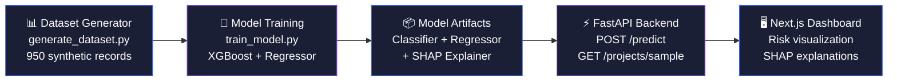

# Δ DELTA — Project Cost-Overrun & Delivery-Risk Prediction

> AI-powered early-warning system for IT project delivery risk, grounded in real industry research.

[]()
[]()
[]()
[]()
[]()

---

## Problem Statement

IT services projects routinely overrun budgets and miss deadlines, but the warning signs — rising employee costs, mid-project attrition, uncontrolled scope creep — are typically detected too late for meaningful intervention. By the time a project is flagged as "at risk" in a traditional PMO review, the cost overrun has already compounded.

**DELTA** is a machine-learning-powered prediction system that analyzes project parameters at any point during execution and returns: (1) a risk classification (on-track / at-risk / failed), (2) a predicted final cost with overrun percentage, and (3) plain-language explanations of the top contributing factors — giving project managers actionable intelligence weeks before traditional indicators would flag a problem.

---

## Why This Matters

The Indian IT services industry faces a structural margin crisis documented in research:

| Metric | Value | Source |
|--------|-------|--------|
| Employee cost-to-revenue ratio | **57%** industry average, trending toward 60% | Industry aggregate data |
| Employee cost growth vs. revenue growth | **206%** vs **185%** over a decade | Research paper analysis |
| Annual attrition rate | **~13–14%** | Industry-wide benchmark |
| Lateral-hire cost premium | **25–30%** above replaced role's cost | Research paper |
| Industry shift | Toward **outcome-based pricing** tied to business impact | Structural trend |

When a project overruns under outcome-based or fixed-bid pricing, the vendor absorbs the loss directly. Late detection means losses compound — each week of undetected risk adds cost that cannot be recovered. DELTA aims to shift detection from reactive (post-mortem) to predictive (in-flight).

---

## Architecture



**Data Flow:**
1. `generate_dataset.py` creates 950 synthetic IT project records with research-grounded correlations
2. `train_model.py` trains an XGBoost classifier (risk label) and a gradient-boosting regressor (cost prediction), generates SHAP analysis
3. Trained model artifacts (`.joblib`) are saved to `model/artifacts/`
4. FastAPI backend loads artifacts at startup and serves real-time predictions via REST API
5. Next.js dashboard calls the API and displays risk assessments with plain-language explanations

---

## Methodology

### Dataset Construction

**950 synthetic IT project records** with 12 raw features (21 after one-hot encoding). Key design decisions:

- **Employee cost ratio** centered at 0.57 (industry average), right-skewed toward 0.60+ — projects above baseline have elevated risk, reflecting the structural driver of margin erosion (employee costs growing faster than revenue)
- **Attrition events** modeled using binomial distribution at ~13.5% annualized rate, scaled by project duration and team size — each event triggers a 25–30% lateral-hire cost premium
- **Scope creep × contract type interaction** — fixed-bid and outcome-based contracts absorb scope changes as direct margin loss; T&M contracts can bill for additional scope
- **Team-budget mismatch** — small teams on large budgets flag under-resourcing risk
- **Gaussian noise** (σ=0.06) added to risk scores to prevent perfect separability

### Why XGBoost

- Gradient-boosted decision trees handle tabular data with mixed feature types naturally
- Native support for SHAP TreeExplainer — enables per-prediction feature importance
- Fast training and inference suitable for real-time API serving
- Well-validated in production ML systems for classification and regression

### Model Performance (Real Numbers)

#### XGBoost Classifier (3-class: on_track / at_risk / failed)

| Class | Precision | Recall | F1-Score | Support |
|-------|-----------|--------|----------|---------|
| on_track | 0.82 | 0.71 | 0.76 | 70 |
| at_risk | 0.64 | 0.71 | 0.68 | 76 |
| failed | 0.71 | 0.73 | 0.72 | 44 |
| **Overall Accuracy** | | | **71.6%** | **190** |

#### Cost Overrun Regressor

| Metric | Value |
|--------|-------|
| MAE | 0.0470 (mean absolute error in overrun ratio) |
| RMSE | 0.0601 |
| R² | 0.7569 |

**Note on accuracy:** 71.6% on a 3-class problem with intentional noise is realistic. The noise is deliberate — real project data would have unexplained variance, and a model that achieves >95% on synthetic data is a red flag, not a success.

### SHAP Explainability

Every prediction comes with the **top 3 contributing factors** translated to plain English:

- *"High number of scope changes is pushing this project's risk up"*
- *"Employee cost ratio above industry baseline (57%) is squeezing margins"*
- *"Team member departures are increasing cost (25–30% lateral-hire premium) and slowing delivery"*

This transforms a black-box risk score into actionable guidance a PM can act on.

---

## Research Grounding

This project draws calibration parameters from **"The Indian IT Services Sector at a Crossroads"** research analysis.

### What the Paper Informed

| Parameter | Paper-Derived Value | How It's Used in DELTA |
|-----------|-------------------|----------------------|
| Employee cost-to-revenue ratio | 57% industry average, TCS at ~60% | Centers the `employee_cost_ratio` feature distribution |
| Cost growth vs. revenue growth | 206% vs. 185% over a decade | Justifies ECR as a primary risk signal |
| Annualized attrition rate | ~13–14% | Scales `attrition_events` per team size and duration |
| Lateral-hire cost premium | 25–30% | Each attrition event adds proportional cost bump |
| Pricing model shift | Toward outcome-based contracts | `client_type` × `scope_change_count` interaction |
| AI cost-saving potential | 30–40% operational cost reduction | Basis for projected impact (not our claimed numbers) |
| Project optimization savings | 14% labor, 12% equipment | ROI framing for market positioning |

### Honesty About Data Origin

> **Important**: The research paper provides **industry-aggregate calibration numbers**, not row-level project records. The training dataset is **entirely synthetic** — individual project records are generated, not observed. The paper's numbers ground the feature distributions and correlation rules in real industry dynamics, but no claim is made that the model was trained on real project data.
>
> This distinction matters. The model demonstrates that the *approach* works — predicting risk from project parameters — but validation on real company data would be needed before any production deployment.

---

## Market Positioning

### Target Customer

**Mid-cap Indian IT services firms** (revenue ₹500Cr–₹5,000Cr) — not TCS/Infosys-scale players who are already building in-house AI capabilities, but the next tier of firms facing the same margin pressure without the R&D budget to develop custom solutions.

### Projected Impact (Paper-Sourced Benchmarks)

These numbers come from the research paper's analysis of AI adoption in IT services, not from DELTA-specific measurements:

- **30–40%** operational cost reduction from AI-augmented project management
- **14%** labor cost savings through optimized resource allocation
- **12%** equipment/infrastructure cost savings
- **6–12 month** expected ROI timeline

### Why This Market

The paper documents that mid-cap firms face disproportionate margin pressure: they lack the scale economies of top-5 players, face the same attrition-driven cost increases, and are most vulnerable to the shift toward outcome-based pricing. A predictive tool that flags at-risk projects 2–4 weeks earlier directly addresses their core business problem.

---

## How to Run Locally

### Prerequisites

- Python 3.10+ with pip
- Node.js 18+ with npm
- ~2GB free disk space

### Step-by-Step

```bash
# Clone the repository
git clone <repo-url>
cd delta-hackathon

# 1. Install Python dependencies
pip install -r requirements.txt

# 2. Generate the synthetic dataset
python data/generate_dataset.py
# → Output: data/synthetic_projects.csv (950 records)

# 3. Train the models
python model/train_model.py
# → Output: model/artifacts/ (classifier, regressor, SHAP plots, metrics)

# 4. Start the backend API
python -m uvicorn backend.main:app --host 0.0.0.0 --port 8000
# → API available at http://localhost:8000
# → Docs at http://localhost:8000/docs

# 5. Start the frontend (new terminal)
cd frontend
npm install
npm run dev
# → Dashboard at http://localhost:3000

# 6. Open http://localhost:3000 in your browser
```

### API Endpoints

| Endpoint | Method | Description |
|----------|--------|-------------|
| `/health` | GET | Health check, confirms models are loaded |
| `/predict` | POST | Accept project features, return risk + cost + SHAP factors |
| `/projects/sample` | GET | Return 8 sample projects with predictions |
| `/docs` | GET | Interactive API documentation (Swagger) |

---

## Tech Stack

| Layer | Technology |
|-------|-----------|
| Data Generation | Python, NumPy, Pandas |
| Model Training | XGBoost, scikit-learn, SHAP, Matplotlib, Seaborn |
| Backend API | FastAPI, Uvicorn, Pydantic |
| Frontend | Next.js 16, TypeScript, React |
| Serialization | Joblib |

---

## Known Limitations

1. **Synthetic data**: The model is trained on 950 generated records, not real company project data. Feature distributions are calibrated to industry benchmarks, but individual records are synthetic.

2. **No temporal validation**: The model treats each project as a snapshot, not a time series. Real project risk evolves over time — a proper system would ingest weekly updates.

3. **Limited feature set**: Real project risk depends on factors not captured here — team dynamics, client relationship quality, technology stack complexity, regulatory environment.

4. **SHAP ≠ causation**: SHAP values explain what the *model* considers important, not what *causes* project failure. They are model-centric explanations, not causal claims.

5. **Exchange rate**: USD/INR conversion uses a hardcoded rate (83.5). A production system would use live rates.

6. **Small dataset**: 950 records is small for ML. More data would improve generalization, but the goal here is demonstrating the approach, not achieving production accuracy.

7. **Validation needed**: Real-world deployment would require partnership with IT services firms to validate on actual project portfolios before trusting predictions for business decisions.

---

## Project Structure

```
delta-hackathon/
├── data/
│   ├── generate_dataset.py    # Synthetic data generator
│   └── synthetic_projects.csv # Generated dataset (950 rows)
├── model/
│   ├── train_model.py         # XGBoost + regressor training
│   └── artifacts/
│       ├── xgb_classifier.joblib
│       ├── cost_regressor.joblib
│       ├── label_encoder.joblib
│       ├── feature_columns.joblib
│       ├── shap_summary.png
│       ├── shap_detailed.png
│       ├── confusion_matrix.png
│       ├── metrics.json
│       └── test_set_with_predictions.csv
├── backend/
│   └── main.py                # FastAPI prediction server
├── frontend/
│   └── app/
│       ├── layout.tsx         # Root layout with metadata
│       ├── page.tsx           # Main dashboard component
│       └── globals.css        # DELTA design system
├── docs/
│   ├── README.md              # This file
│   └── VIDEO_SCRIPT.md        # Demo video script
└── requirements.txt           # Python dependencies
```

---

## License

MIT License — see [LICENSE](../LICENSE) for details.

---

*Built for the Open Innovation Track hackathon. DELTA demonstrates that early-warning project risk prediction is achievable with standard ML tools, transparent explainability, and honest acknowledgment of what synthetic data can and cannot prove.*
