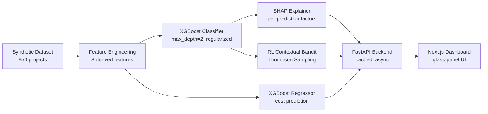

# Δ DELTA — Project Cost-Overrun & Delivery-Risk Prediction

> Early-warning AI system that predicts IT project failures before they become expensive.

## Problem Statement

IT service delivery firms lose millions annually to project cost overruns and missed deadlines. The core problem: by the time a project is visibly failing, the damage is already compounding — attrition spikes, scope balloons, and fixed-bid contracts lock in losses. **DELTA predicts project risk early** and recommends interventions, giving PMO teams time to act.

## Why This Matters — The Margin Squeeze

Based on analysis from *"The Indian IT Services Sector at a Crossroads"* (industry research paper):

| Metric | Value | Impact |
|--------|-------|--------|
| Employee costs rose | **206%** over a decade | While revenue grew only 185% |
| Employee-cost-to-revenue ratio | **57-60%** (industry avg) | And rising — squeezing margins |
| Annualized attrition | **~13-14%** | Each replacement costs 25-30% premium (lateral hire) |
| Shift to outcome-based pricing | Accelerating | Overruns are now the vendor's loss, not the client's |

Mid-cap IT firms (not TCS/Infosys, who build in-house AI) lack predictive tools to catch at-risk projects early. DELTA targets this gap.

## Architecture



## Methodology

### Dataset

- **950 synthetic records** with 12 raw features, calibrated against industry-aggregate research parameters (not row-level real data)
- Distribution targets: 37% on_track / 40% at_risk / 23% failed
- Employee cost ratio mean: 0.581 (matching the industry average of 0.57-0.60)
- **Validated for plausibility** against the Desharnais dataset (81 real projects) from the PROMISE Software Engineering Repository — see [sanity check](docs/real_data_sanity_check.md)

### Secondary Real-Data Validation

To validate the underlying modeling approach on real software engineering data, we ran two secondary validation tests using the PROMISE repository. Note that these are separate tasks with smaller feature sets than the primary synthetic classifier. See [Real Data Validation](docs/real_data_validation.md) for full metrics and learning curves.

**1. Kitchenham Dataset (n=145)**
- **Task:** Regression on project cost overrun ratio (`log(Actual/Estimated)`).
- **Result:** XGBoost Regressor (max_depth=2) achieved a cross-validated Val MAE of 0.275 (Train MAE: 0.148). The negative R² indicates the difficulty of regression on this small, noisy sample, confirming why we rely on synthetic data to model operational variables (attrition, contract types) not present here.

**2. NASA93 Dataset (n=93)**
- **Task:** Size-to-effort regression predicting `log(act_effort)` from standard COCOMO-I cost drivers and LOC. 
- **Result:** XGBoost Regressor (max_depth=2) achieved a cross-validated **Val R² of 0.735 ± 0.153**, validating that the underlying algorithm reliably models standard parametric software metrics on real data.

### Model Selection: Why XGBoost

Gradient-boosted trees handle tabular data with mixed feature types well, train fast, and are directly interpretable via SHAP's TreeExplainer. We chose a **single well-tuned XGBoost** over an ensemble for cleaner SHAP explanations.

> **Design decision**: A VotingClassifier ensemble (XGBoost + Random Forest + Gradient Boosting) was explored in v2.0. It was deprioritized in favor of SHAP interpretability and stability — a single model produces a cleaner explanatory story for each prediction, which matters more for a PMO decision-support tool than marginal accuracy gains.

### The Overfitting Story — A Genuine Diagnostic Win

Our initial model (v1, `max_depth=6`) achieved **100% training accuracy** but only **70% validation accuracy** — a 30% generalization gap. This is textbook overfitting on a 950-record dataset.

**Diagnosis process** (see `model/diagnose_model.py`):
1. Generated learning curves → confirmed high variance (diverging train/val)
2. Swept max_depth from 1-8 → identified depth=2 as optimal
3. Applied strong regularization: `min_child_weight=10`, `reg_lambda=5`, `gamma=1`, `subsample=0.7`

**Result**:

| Metric | v1 (Overfitting) | v2.1 (Fixed) |
|--------|-----------------|--------------|
| Training accuracy | 100% 🔴 | 84.5% ✅ |
| Validation accuracy | 70.0% | 74.9% |
| **Generalization gap** | **30.0%** | **10.1%** |
| max_depth | 6 | 2 |

### Performance Metrics (v2.1 — Final)

**Classifier** (3-class: on_track / at_risk / failed):

| Class | Precision | Recall | F1 | Support |
|-------|-----------|--------|----|---------|
| at_risk | 0.63 | 0.78 | 0.69 | 76 |
| failed | 0.76 | 0.64 | 0.69 | 44 |
| on_track | 0.83 | 0.70 | 0.76 | 70 |
| **Overall accuracy** | | | **0.72** | 190 |

- 5-fold CV accuracy: 75.5% ± 2.4%
- Best hyperparameters: `max_depth=2`, `n_estimators=300`, `learning_rate=0.05`

**Cost Regressor**: MAE=0.043, RMSE=0.056, R²=0.787

### Feature Engineering

8 domain-specific derived features grounded in industry knowledge:

| Feature | Formula | Rationale |
|---------|---------|-----------|
| `scope_fixed_bid_pressure` | scope_changes × is_fixed_bid | Scope creep under fixed-bid = trapped cost |
| `attrition_cost_burden` | attrition × ECR × 0.275 | Each replacement costs 25-30% premium |
| `budget_per_person_week` | budget / (team × weeks) | Low = underfunded project |
| `junior_heavy` | junior>40% AND senior<25% | Risky team composition flag |
| `burn_instability` | burn_variance × duration | Longer projects amplify variance |
| `ecr_above_baseline` | max(0, ECR - 0.57) | How far above industry average |
| `scope_intensity` | scope_changes / weeks | Scope change rate per week |
| `attrition_rate` | attrition / team_size | Normalized attrition |

### SHAP Explainability

Every prediction includes the top 3 SHAP factors in plain English:
- *"Cumulative attrition costs (lateral-hire premiums) are significant"*
- *"Employee costs are well-managed relative to the budget"*
- *"Low scope creep is helping keep this project on track"*

### RL Intervention Recommendations

DELTA includes a **contextual bandit** (Thompson Sampling) that recommends project interventions:

| Action | Description |
|--------|-------------|
| Freeze Scope | Stop accepting new scope changes |
| Add Senior Staff | Increase senior developer ratio by 15% |
| Right-Size Team | Adjust team size to match budget capacity |
| Switch to T&M | Negotiate contract change to time-and-material |
| Increase Monitoring | Reduce burn-rate variance with weekly reviews |

**Important**: Rewards come from **counterfactual simulation** through the trained classifier — the bandit asks "what would happen if we applied this intervention?" and re-predicts. This demonstrates prescriptive analytics at demo scale. It does **not** learn from real intervention outcomes, which would require deployed usage data.

## Research Grounding

Calibration numbers from *"The Indian IT Services Sector at a Crossroads"*:

- **Employee cost ratio baseline**: 57-60% of revenue (industry average)
- **Attrition rate**: ~13-14% annualized
- **Lateral-hire premium**: 25-30% above existing employee cost
- **AI cost-saving benchmarks**: 30-40% operational cost reduction, 14% labor savings, 12% equipment cost savings, 6-12 month ROI
- **Go-to-market rationale**: Mid-cap firms lack in-house AI capabilities

> **These are industry-aggregate calibration parameters** used to make synthetic data realistic. The paper provided directional guidance, not row-level training data.

## Market Positioning

- **Target**: Mid-cap Indian IT service firms (₹5,000-₹50,000 Cr revenue)
- **Not targeting**: Tier-1 firms (TCS, Infosys, Wipro) — they build in-house AI
- **Value prop**: Early-warning predictions + actionable interventions
- **Paper's benchmarks**: 30-40% operational cost reduction possible with AI tooling

## How to Run Locally

```bash
# 1. Clone and install
git clone <repo-url>
cd delta-hackathon
pip install -r requirements.txt

# 2. Generate dataset
python data/generate_dataset.py

# 3. Train models
python model/train_model_v2.py

# 4. Start backend API
python -m uvicorn backend.main:app --host 0.0.0.0 --port 8000

# 5. Start frontend (in another terminal)
cd frontend
npm install
npm run dev

# 6. Open http://localhost:3000
```

## API Endpoints

| Endpoint | Method | Description |
|----------|--------|-------------|
| `/health` | GET | Health check + model info |
| `/predict` | POST | Risk class + cost + SHAP + RL recommendations |
| `/projects/sample` | GET | 8 sample projects with predictions |
| `/metrics` | GET | Model training metrics |
| `/docs` | GET | Interactive API docs (Swagger) |

## Known Limitations

1. **Synthetic training data**: 950 generated records, not real company projects. Model accuracy would likely differ with real data.
2. **Limited real-data validation**: Plausibility checked against one PROMISE dataset (Desharnais, 81 projects) — not a rigorous statistical validation.
3. **No temporal modeling**: Time-series aspects of project progression are not captured. Each prediction is a point-in-time snapshot.
4. **SHAP is model-centric**: Feature importance reflects what the model learned, not necessarily causal relationships.
5. **RL reward is simulated**: Counterfactual simulation through the classifier, not observed real outcomes.
6. **Exchange rate hardcoded**: USD/INR at 83.5 — not dynamically updated.
7. **Missing long projects**: Synthetic data caps at ~30 weeks; real portfolios include multi-year engagements.
8. **Small validation sample**: Desharnais has only 81 projects with different feature definitions.

## What Would Make This Production-Ready

1. **Real company data**: Partnership with 2-3 mid-cap IT firms to collect 5,000+ real project records
2. **Temporal features**: Weekly burn-rate time series, milestone tracking
3. **RL from real outcomes**: Observe actual intervention results to train the bandit
4. **A/B testing**: Compare PMO decisions with and without DELTA predictions
5. **Dynamic exchange rates**: API-fetched currency conversion

## Tech Stack

| Component | Technology |
|-----------|------------|
| ML Models | XGBoost, scikit-learn |
| Explainability | SHAP (TreeExplainer) |
| RL | Thompson Sampling (custom) |
| Backend | FastAPI, Python 3.13 |
| Frontend | Next.js, TypeScript |
| Deployment | Render (backend), Vercel (frontend) |

## Repository Structure

```
delta-hackathon/
├── data/                    # Dataset generation + sanity check
│   ├── generate_dataset.py  # Synthetic data generator
│   ├── synthetic_projects.csv
│   ├── desharnais_promise.csv
│   └── sanity_check_promise.py
├── model/                   # Training + diagnostics
│   ├── train_model_v2.py    # Final training pipeline
│   ├── diagnose_model.py    # Overfitting diagnostics
│   ├── artifacts/           # Saved models + metrics
│   └── diagnostics/         # Learning curves, plots
├── backend/                 # FastAPI server
│   └── main.py
├── frontend/                # Next.js dashboard
│   └── app/
├── docs/                    # Documentation
│   ├── README.md
│   ├── VIDEO_SCRIPT.md
│   └── real_data_sanity_check.md
├── requirements.txt
├── Procfile                 # Render deployment
└── render.yaml
```

## License

MIT
