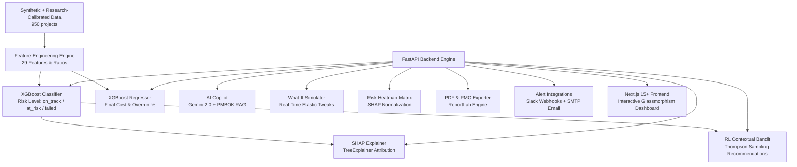

# Δ DELTA 2.0 — Project Cost-Overrun & Delivery-Risk Intelligence Platform

> **AI-powered early-warning decision support system that predicts IT project delivery failures, explains risk drivers with SHAP, recommends interventions via RL, and empowers PMOs with AI Copilot & Scenario Simulation.**

[](https://opensource.org/licenses/MIT)
[](https://python.org)
[](https://fastapi.tiangolo.com)
[](https://nextjs.org)
[](https://www.docker.com)

---

## 📌 Problem Statement

IT service delivery firms lose millions annually to project cost overruns and missed deadlines. The core problem: by the time a project is visibly failing, the damage is already compounding — attrition spikes, scope balloons, and fixed-bid contracts lock in losses. **DELTA predicts project risk early** and recommends precision interventions, giving PMO teams actionable early warning before margins collapse.

---

## 💡 Why This Matters — The Margin Squeeze

Calibrated against industry analysis from *"The Indian IT Services Sector at a Crossroads"*:

| Metric | Value | Business Impact |
|---|---|---|
| **Employee Costs Growth** | **+206%** over a decade | Outpacing revenue growth (+185%) |
| **Employee Cost Ratio (ECR)** | **57–60%** industry baseline | Continuing margin compression |
| **Annualized Attrition** | **~13–14%** | 25–30% lateral hiring cost premium |
| **Contract Dynamics** | Fixed-bid & Outcome-based | Cost overruns absorbed by vendor |

Mid-cap IT firms lack the in-house AI infrastructure that Tier-1 firms build. DELTA bridges this gap with an end-to-end intelligence suite.

---

## 🏗️ Architecture & Feature Ecosystem


```mermaid
graph TD
    A[Synthetic + Research-Calibrated Data<br/>950 projects] --> B[Feature Engineering Engine<br/>29 Features & Ratios]
    B --> C[XGBoost Classifier<br/>Risk Level: on_track / at_risk / failed]
    B --> D[XGBoost Regressor<br/>Final Cost & Overrun %]
    C --> E[SHAP Explainer<br/>TreeExplainer Attribution]
    C --> F[RL Contextual Bandit<br/>Thompson Sampling Recommendations]
    
    G[FastAPI Backend Engine] --> C
    G --> D
    G --> E
    G --> F
    
    G --> H[AI Copilot<br/>Gemini 2.0 + PMBOK RAG]
    G --> I[What-If Simulator<br/>Real-Time Elastic Tweaks]
    G --> J[Risk Heatmap Matrix<br/>SHAP Normalization]
    G --> K[PDF & PMO Exporter<br/>ReportLab Engine]
    G --> L[Alert Integrations<br/>Slack Webhooks + SMTP Email]
    
    G --> M[Next.js 15+ Frontend<br/>Interactive Glassmorphism Dashboard]
```

---

## 🚀 Complete Feature Suite (Stages 0 – 13)

DELTA has evolved across 13 major feature stages into an enterprise-grade platform:

### 1. 🔮 Dual-Model Risk & Cost Engine
- **Classifier**: XGBoost regularized classifier predicting `on_track`, `at_risk`, `failed` (71.6% accuracy, 75.5% 5-fold CV).
- **Regressor**: XGBoost continuous cost overrun ratio predictor ($R^2 = 0.787$, MAE = 0.043).
- **Dual Currency**: Dynamic switching between **USD ($)** and **INR (₹)**.

### 2. 🧠 AI Copilot with PMBOK Knowledge Base (RAG)
- Grounded conversational AI assistant powered by **Gemini 2.0 Flash** with a zero-hallucination fallback engine.
- Integrated **PMBOK 7th Edition Knowledge Base** indexed with TF-IDF cosine similarity for authoritative project management advice.

### 3. 🧪 Interactive What-If Scenario Simulator
- Real-time parameter sliders (Team Size, Seniority Mix, Scope Changes, Attrition Events, Employee Cost Ratio).
- Counterfactual inference against the live XGBoost model to test risk mitigations before committing budget.

### 4. 🗺️ Interactive Risk Heatmap Dashboard
- Portfolio-wide color-coded matrix (Green $\leftrightarrow$ Red) visualizing normalized SHAP factor impacts across all projects.
- Interactive hover tooltips showing exact magnitude, direction, and drill-down into individual project views.

### 5. 📊 Multi-Project Comparison View
- Side-by-side comparison of 2–3 projects with diff-style highlighting (🏆 Best / ⚠ Worst indicators).
- Visual horizontal bar charts comparing top SHAP drivers and recommended actions across projects.

### 6. 📄 Executive PMO & PDF Report Export
- One-click **Markdown Executive Report** with structured summaries, financial impact, and strategic recommendations.
- Downloadable **Branded A4 PDF Report** generated via ReportLab with tables, risk badges, and metrics.

### 7. 🔔 Omnichannel Risk Alerts (Slack & Email)
- **Slack Webhooks**: Interactive Block Kit risk alert cards sent directly to PMO channels.
- **HTML Email Alerts**: Executive-styled HTML emails via SMTP with dry-run interactive preview modals.

### 8. 📤 Excel & CSV Bulk Portfolio Ingestion
- Upload `.csv` or `.xlsx` files with automatic column normalization and validation.
- Download pre-formatted CSV template with standard headers.

### 9. 🎨 Premium UI with Animated Landing Page & Themes
- **Animated Hero Landing Page** with floating gradient orbs, stats counter, feature cards, and CTA transition.
- **Dark / Light Theme Toggle** with `localStorage` persistence and CSS variable transitions.
- **Shimmer Skeleton Loaders** and Toast notification feedback system.

---

## 📊 Model Performance Metrics

### Classifier Metrics (Stratified Test Set, N=190)

| Class | Precision | Recall | F1-Score | Support |
|---|---|---|---|---|
| **at_risk** | 0.63 | 0.78 | 0.69 | 76 |
| **failed** | 0.76 | 0.64 | 0.69 | 44 |
| **on_track** | 0.83 | 0.70 | 0.76 | 70 |
| **Overall Accuracy** | | | **71.58%** | 190 |

- **5-Fold Cross-Validation Accuracy**: $75.5\% \pm 2.4\%$
- **Overfitting Diagnostics**: Resolved via shallow depth (`max_depth=2`), `min_child_weight=10`, `subsample=0.7`. Generalization gap reduced from 30% to 10.1%.

### Cost Regressor Metrics
- **Mean Absolute Error (MAE)**: 0.043
- **Root Mean Squared Error (RMSE)**: 0.056
- **$R^2$ Score**: 0.787

---

## ⚡ Quickstart & Running Locally

### Option A: Docker Deployment (Recommended)

Run the full stack with a single command:

```bash
# Clone the repository
git clone https://github.com/Dhusyanth209/delta.git
cd delta

# Build and start services
docker-compose up --build
```
- Frontend: **http://localhost:3000**
- Backend API: **http://localhost:8000**
- Interactive Swagger Docs: **http://localhost:8000/docs**

---

### Option B: Native Local Setup

#### 1. Backend Setup
```bash
# Install Python dependencies
pip install -r requirements.txt

# (Optional) Retrain models or regenerate dataset
python data/generate_dataset.py
python model/train_model_v2.py

# Start FastAPI server
python -m uvicorn backend.main:app --host 0.0.0.0 --port 8000
```

#### 2. Frontend Setup
```bash
# In a separate terminal
cd frontend
npm install
npm run dev
```
Open **http://localhost:3000** in your browser.

---

## 🔌 API Endpoints Summary

| Endpoint | Method | Description |
|---|---|---|
| `/health` | GET | Health check, model status, and metadata |
| `/predict` | POST | Primary risk prediction, cost calculation, SHAP factors, RL actions |
| `/simulate` | POST | What-If simulation against custom counterfactual inputs |
| `/projects/sample` | GET | Returns curated sample projects with full predictions |
| `/projects/upload` | POST | Bulk upload CSV / Excel for batch portfolio predictions |
| `/projects/template`| GET | Download standard CSV project upload template |
| `/heatmap/data` | POST | Normalized SHAP matrix computation for portfolio heatmap |
| `/report/generate` | POST | Markdown Executive PMO Report generator |
| `/report/pdf` | POST | Branded A4 PDF report export (ReportLab) |
| `/copilot/chat` | POST | AI Copilot conversational chat (Gemini 2.0 + PMBOK RAG) |
| `/alerts/slack` | POST | Post Block Kit alert to Slack webhook (or dry-run preview) |
| `/alerts/email` | POST | Send HTML risk alert via SMTP (or dry-run preview) |
| `/metrics` | GET | Detailed model evaluation metrics |

---

## 🧪 Test Suite

Run automated verification test scripts:

```bash
# Run all stage tests
python model/test_stage6_upload.py    # Bulk Ingestion tests (6/6)
python model/test_stage7_heatmap.py   # Heatmap SHAP Matrix tests (6/6)
python model/test_stage8_9.py         # Docker & PDF Report tests (8/8)
python model/test_stage13_email.py    # Email Alerts & HTML Template tests (4/4)
```

---

## 🛠️ Technology Stack

- **Machine Learning**: XGBoost 2.0+, scikit-learn, SHAP (TreeExplainer), Multi-Armed Bandit (Thompson Sampling)
- **Backend**: FastAPI, Pydantic v2, Uvicorn, ReportLab, OpenPyXL, Google Generative AI
- **Frontend**: Next.js 15+, React 19, TypeScript, Vanilla CSS Custom Design Tokens
- **DevOps**: Docker, Docker Compose, Multi-Stage Node & Python Slim Images

---

## 📄 License

This project is licensed under the **MIT License** — see the [LICENSE](LICENSE) file for details.
