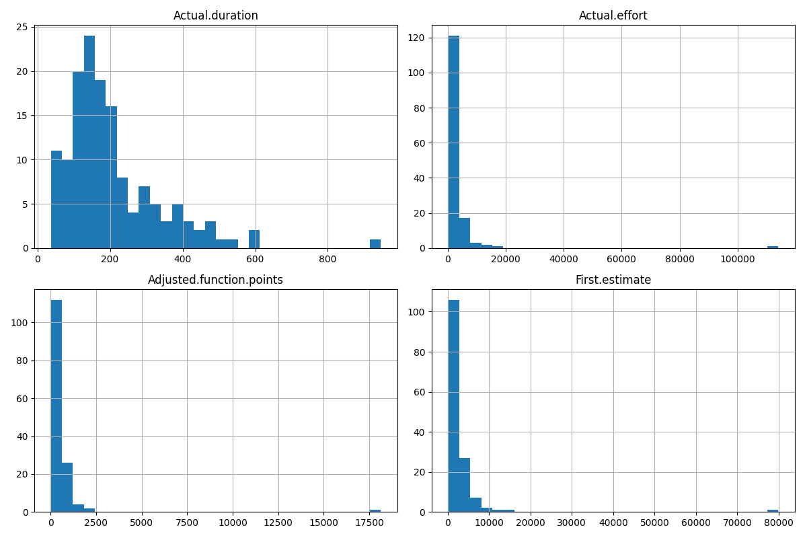

# Kitchenham Dataset EDA

**Rows:** 145
**Columns:** 10

### Data Types
```text
Project                        int64
Client.code                    int64
Project.type                  object
Actual.start.date             object
Actual.duration                int64
Actual.effort                  int64
Adjusted.function.points     float64
Estimated.completion.date     object
First.estimate                 int64
First.estimate.method         object
dtype: object
```

### Missing Values
```text
Project                       0
Client.code                   0
Project.type                 10
Actual.start.date             0
Actual.duration               0
Actual.effort                 0
Adjusted.function.points      0
Estimated.completion.date     3
First.estimate                0
First.estimate.method         0
dtype: int64
```

### Numeric Columns

```text

                             min        max         mean      50%
Actual.duration            37.00     946.00   206.448276   171.00
Actual.effort             219.00  113930.00  3113.117241  1557.00
Adjusted.function.points   15.36   18137.48   527.669310   260.95
First.estimate            121.00   79870.00  2855.972414  1750.00

```



### Skewness Check

- **Actual.duration**: Normal (max 946.00, mean 206.45).

- **Actual.effort**: Heavy skew detected (max 113930.00 > 10 * mean 3113.12). Needs log-transform.

- **Adjusted.function.points**: Heavy skew detected (max 18137.48 > 10 * mean 527.67). Needs log-transform.

- **First.estimate**: Heavy skew detected (max 79870.00 > 10 * mean 2855.97). Needs log-transform.


### Categorical Columns

#### Client.code
```text

Client.code
2    116
1     16
3      4
4      4
6      4
5      1
Name: count, dtype: int64

```

- **Rare categories (<5):** [3, 4, 6, 5] -> Needs collapse into 'Other'

- **Imbalance:** Top client is 80.0% of data.

#### Project.type
```text

Project.type
P      75
D      52
NaN    10
A       4
C       2
Pr      1
U       1
Name: count, dtype: int64

```

- **Rare categories (<5):** ['A', 'C', 'Pr', 'U'] -> Needs collapse into 'Other'

#### First.estimate.method
```text

First.estimate.method
EO     105
A       34
D        3
C        1
CAE      1
W        1
Name: count, dtype: int64

```

- **Rare categories (<5):** ['D', 'C', 'CAE', 'W'] -> Needs collapse into 'Other'


### Target Variable Analysis

Target: `overrun_ratio = Actual.effort / First.estimate`
```text

count    145.000000
mean       1.014408
std        0.525618
min        0.217988
25%        0.790084
50%        0.973274
75%        1.070455
max        5.933884
Name: overrun_ratio, dtype: float64

```

Number of 'failed' projects (overrun > 1.5): 10 (6.9%)

Conclusion: Treat as REGRESSION on log(overrun_ratio) due to target imbalance.
