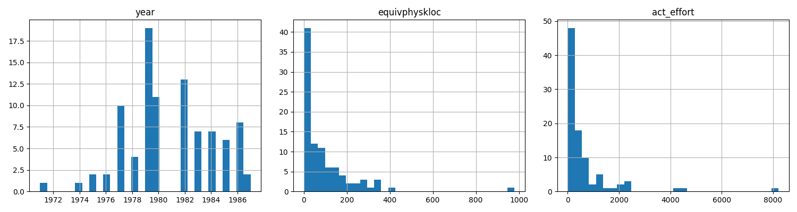

# NASA93 Dataset EDA

**Rows:** 93
**Columns:** 24

### Data Types
```text
recordnumber       int64
projectname       object
cat2              object
forg              object
center             int64
year               int64
mode              object
rely              object
data              object
cplx              object
time              object
stor              object
virt              object
turn              object
acap              object
aexp              object
pcap              object
vexp              object
lexp              object
modp              object
tool              object
sced              object
equivphyskloc    float64
act_effort       float64
dtype: object
```

### Missing Values
```text
recordnumber     0
projectname      0
cat2             0
forg             0
center           0
year             0
mode             0
rely             0
data             0
cplx             0
time             0
stor             0
virt             0
turn             0
acap             0
aexp             0
pcap             0
vexp             0
lexp             0
modp             0
tool             0
sced             0
equivphyskloc    0
act_effort       0
dtype: int64
```

### Numeric Columns

```text

                  min     max         mean     50%
year           1971.0  1987.0  1980.827957  1980.0
equivphyskloc     0.9   980.0    94.022043    47.5
act_effort        8.4  8211.0   624.411828   252.0

```



### Skewness Check

- **year**: Normal (max 1987.00, mean 1980.83).

- **equivphyskloc**: Heavy skew detected (max 980.00 > 10 * mean 94.02). Needs log-transform.

- **act_effort**: Heavy skew detected (max 8211.00 > 10 * mean 624.41). Needs log-transform.


### Categorical Columns

#### projectname
```text

projectname
Y      38
X      23
gal    13
de      8
spl     4
slp     3
hst     3
erb     1
Name: count, dtype: int64

```

- **Rare categories (<5):** ['spl', 'slp', 'hst', 'erb'] -> Might need collapse or drop (per instructions, cat2/projectname/center to be dropped)

#### cat2
```text

cat2
avionicsmonitoring     30
missionplanning        20
Avionics               11
monitor_control         8
operatingsystem         4
simulation              4
datacapture             3
realdataprocessing      3
utility                 2
batchdataprocessing     2
science                 2
application_ground      2
communications          1
launchprocessing        1
Name: count, dtype: int64

```

- **Rare categories (<5):** ['operatingsystem', 'simulation', 'datacapture', 'realdataprocessing', 'utility', 'batchdataprocessing', 'science', 'application_ground', 'communications', 'launchprocessing'] -> Might need collapse or drop (per instructions, cat2/projectname/center to be dropped)

#### forg
```text

forg
g    80
f    13
Name: count, dtype: int64

```

#### center
```text

center
5    39
2    37
1    12
6     3
3     2
Name: count, dtype: int64

```

- **Rare categories (<5):** [6, 3] -> Might need collapse or drop (per instructions, cat2/projectname/center to be dropped)

#### mode
```text

mode
semidetached    69
embedded        21
organic          3
Name: count, dtype: int64

```

- **Rare categories (<5):** ['organic'] -> Might need collapse or drop (per instructions, cat2/projectname/center to be dropped)

#### rely
```text

rely
h     42
n     39
vh    10
l      2
Name: count, dtype: int64

```

- **Rare categories (<5):** ['l'] -> Might need collapse or drop (per instructions, cat2/projectname/center to be dropped)

#### data
```text

data
l     37
n     31
h     17
vh     8
Name: count, dtype: int64

```

#### cplx
```text

cplx
h     58
vh    17
n     10
xh     5
l      3
Name: count, dtype: int64

```

- **Rare categories (<5):** ['l'] -> Might need collapse or drop (per instructions, cat2/projectname/center to be dropped)

#### time
```text

time
n     54
vh    18
h     13
xh     8
Name: count, dtype: int64

```

#### stor
```text

stor
n     49
vh    21
xh    13
h     10
Name: count, dtype: int64

```

#### virt
```text

virt
l    65
n    19
h     9
Name: count, dtype: int64

```

#### turn
```text

turn
l     42
n     29
h     20
vh     2
Name: count, dtype: int64

```

- **Rare categories (<5):** ['vh'] -> Might need collapse or drop (per instructions, cat2/projectname/center to be dropped)

#### acap
```text

acap
h     51
n     32
vh    10
Name: count, dtype: int64

```

#### aexp
```text

aexp
h     46
n     34
vh    12
l      1
Name: count, dtype: int64

```

- **Rare categories (<5):** ['l'] -> Might need collapse or drop (per instructions, cat2/projectname/center to be dropped)

#### pcap
```text

pcap
n     44
h     39
vh    10
Name: count, dtype: int64

```

#### vexp
```text

vexp
n     53
h     22
l     14
vl     4
Name: count, dtype: int64

```

- **Rare categories (<5):** ['vl'] -> Might need collapse or drop (per instructions, cat2/projectname/center to be dropped)

#### lexp
```text

lexp
h     69
n     14
l      6
vl     4
Name: count, dtype: int64

```

- **Rare categories (<5):** ['vl'] -> Might need collapse or drop (per instructions, cat2/projectname/center to be dropped)

#### modp
```text

modp
h     37
n     30
l     19
vh     6
vl     1
Name: count, dtype: int64

```

- **Rare categories (<5):** ['vl'] -> Might need collapse or drop (per instructions, cat2/projectname/center to be dropped)

#### tool
```text

tool
n     51
l     18
vh    11
h     10
vl     3
Name: count, dtype: int64

```

- **Rare categories (<5):** ['vl'] -> Might need collapse or drop (per instructions, cat2/projectname/center to be dropped)

#### sced
```text

sced
n    40
l    34
h    19
Name: count, dtype: int64

```


### Target Variable Analysis

Target: `act_effort` (predict log(act_effort) from log(equivphyskloc) + mode + ordinal drivers)
```text

count      93.000000
mean      624.411828
std      1135.928065
min         8.400000
25%        70.000000
50%       252.000000
75%       600.000000
max      8211.000000
Name: act_effort, dtype: float64

```

Conclusion: Treat as REGRESSION on log(act_effort).
