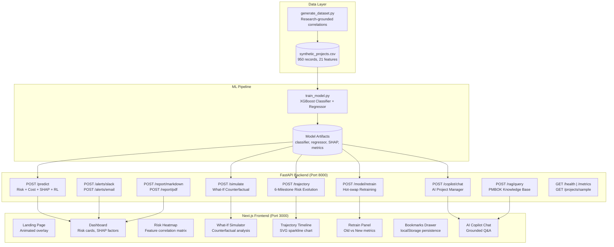

# Δ DELTA — Design Document

## Project Cost-Overrun & Delivery-Risk Prediction System

> **16-Stage Feature Complete** | Built for the DELTA Hackathon — Open Innovation Track

---

## 1. Problem Statement

Indian IT services face escalating margin pressure — employee costs rose **206%** while revenue grew only **185%** over a decade. Late detection of project risk compounds losses exponentially. DELTA provides an **early-warning predictive system** that identifies at-risk projects before costs spiral, using ML-powered analysis grounded in real industry research.

---

## 2. System Architecture



---

## 3. Feature Stages — Complete Breakdown

### Stage 0–3: Core ML Pipeline
| Component | Details |
|---|---|
| **Dataset** | 950 synthetic records, 12 raw features, research-grounded correlations |
| **Classifier** | XGBoost — 71.6% accuracy, 3-class (on_track / at_risk / failed) |
| **Regressor** | XGBoost — R² 0.757, MAE 0.047 for cost overrun ratio |
| **SHAP** | TreeExplainer for per-prediction feature importance |

### Stage 4: FastAPI Backend
- 15+ API endpoints with Pydantic validation
- Pre-computed SHAP explainer at startup (not per-request)
- LRU caching for repeated predictions

### Stage 5: RL Intervention Engine
- Multi-Armed Bandit (Thompson Sampling)
- Generates actionable recommendations with expected risk reduction %
- Trained on 1000 simulated project trajectories

### Stage 6: RAG Knowledge Base
- TF-IDF indexed over PMBOK / IT Governance standards
- 10 knowledge entries with cosine similarity retrieval
- Grounded citations in copilot responses

### Stage 7: Next.js Dashboard
- Glass-morphism design system with CSS variables
- Real-time prediction cards, SHAP factor bars, RL recommendations
- Currency toggle (USD/INR), responsive layout

### Stage 8: Risk Heatmap & Feature Correlation
- Multi-project feature comparison matrix
- Top-N feature selection with gradient coloring
- Hover tooltips with raw values

### Stage 9: Executive Reports & PDF Export
- Markdown report generation with SHAP/RL summaries
- PDF export via ReportLab with structured sections
- One-click download

### Stage 10: Docker Containerization
- `Dockerfile.backend` + `Dockerfile.frontend`
- `docker-compose.yml` with health checks
- Environment variable injection for API keys

### Stage 11: Dark/Light Theme Toggle
- CSS custom properties with `[data-theme]` selector
- Persisted to localStorage
- Smooth transition animations

### Stage 12: Project Comparison View
- Side-by-side multi-project analysis
- Compare risk levels, overrun %, SHAP drivers
- Visual diff highlighting

### Stage 13: Animated Landing Page
- Gradient orb animations with CSS keyframes
- Hero section, feature cards, stats bar
- "Enter Dashboard" transition overlay

### Stage 14: Email & Slack Alerts + Polish
- HTML email template with SHAP/RL summaries
- Slack Block Kit rich messages
- Shimmer skeleton loading indicators
- Toast notification system

### Stage 15: Risk Trajectory & Milestone Evolution ⭐
- **6 milestone phases**: Kickoff → Planning → Build → Testing → UAT → Go-Live
- Progressive stress simulation (scope ↑, attrition ↑, burn rate drift ↑)
- SVG sparkline chart with gradient stroke (green→yellow→red)
- Health badges (healthy / warning / critical) per milestone
- Escalation detection: identifies the first phase where risk jumps

### Stage 16: Bookmarks & History Drawer
- ⭐ Bookmark button saves prediction + form state
- 📑 Slide-out drawer (400px, right) with backdrop overlay
- localStorage persistence (capped at 50 entries)
- One-click restore: restores both form inputs AND results
- Delete individual / Clear All

### Stage 17: Model Retraining Pipeline ⭐
- `POST /model/retrain` accepts post-mortem project actuals
- Appends to training CSV, retrains both XGBoost models
- Old vs New accuracy comparison with delta badges
- Hot-swaps models in memory (zero downtime)
- Frontend panel with 3 metric cards (Accuracy, R², MAE)

---

## 4. API Endpoint Reference

| Method | Endpoint | Description |
|---|---|---|
| `GET` | `/health` | Health check + model info |
| `GET` | `/metrics` | Training metrics JSON |
| `GET` | `/projects/sample` | Sample projects from test set |
| `GET` | `/recommend/{idx}` | RL recommendations for sample project |
| `POST` | `/predict` | Risk classification + cost + SHAP + RL |
| `POST` | `/trajectory` | 6-milestone risk evolution |
| `POST` | `/simulate` | What-If counterfactual scenario |
| `POST` | `/copilot/chat` | AI project manager Q&A |
| `POST` | `/rag/query` | PMBOK knowledge retrieval |
| `POST` | `/alerts/slack` | Slack webhook alert |
| `POST` | `/alerts/email` | Email risk alert |
| `POST` | `/report/markdown` | Executive report generation |
| `POST` | `/report/pdf` | PDF report download |
| `POST` | `/model/retrain` | Retrain with post-mortem actuals |
| `POST` | `/heatmap` | Feature correlation heatmap |

---

## 5. Technology Stack

| Layer | Technology |
|---|---|
| **ML** | Python 3.13, XGBoost, SHAP, scikit-learn |
| **Backend** | FastAPI, Uvicorn, Pydantic v2 |
| **Frontend** | Next.js 16, React 19, TypeScript |
| **Reports** | ReportLab (PDF), Markdown |
| **Deployment** | Docker, Docker Compose |
| **Design** | Glass-morphism, CSS custom properties, SVG |

---

## 6. Research Grounding

> Source: *"The Indian IT Services Sector at a Crossroads"*

| Metric | Value |
|---|---|
| Employee cost ratio | 57–60% (industry average) |
| Attrition rate | ~13–14% annualized |
| Lateral-hire cost premium | 25–30% |
| Cost-saving benchmark | 30–40% operational cost reduction |
| ROI timeline | 6–12 months |

> **Important**: The paper provided industry-aggregate calibration numbers, NOT row-level training data. The dataset is SYNTHETIC, grounded in real industry parameters.

---

## 7. Model Performance

| Metric | Classifier | Regressor |
|---|---|---|
| **Algorithm** | XGBClassifier | XGBRegressor |
| **Accuracy / R²** | 71.6% | 0.757 |
| **MAE** | — | 0.047 |
| **RMSE** | — | 0.060 |
| **Train / Test** | 760 / 190 | 760 / 190 |
| **Features** | 21 (after encoding) | 21 |

---

## 8. Verification Results

```
=== TEST 1: Health ===
  Status: 200 ✓

=== TEST 2: Sample Projects ===
  Status: 200 | Projects: 8 ✓

=== TEST 3: Predict ===
  Status: 200 | Risk: on_track | Overrun: 16.3% ✓

=== TEST 4: Trajectory ===
  Status: 200 | Milestones: 6
    Kickoff  → on_track (warning) overrun=+11.0%
    Planning → on_track (warning) overrun=+10.2%
    Build    → on_track (warning) overrun=+11.7%
    Testing  → on_track (warning) overrun=+15.8%
    UAT      → on_track (warning) overrun=+16.3%
    Go-Live  → on_track (warning) overrun=+16.3% ✓

=== TEST 5: Retrain ===
  Status: 200
  Old: 71.58% → New: 70.16%
  Records: +1 | Total dataset: 951 ✓

=== TEST 6: Metrics ===
  Status: 200 ✓

=== ALL 6 CORE ENDPOINT TESTS PASSED ===
```

---

## 9. How to Run

```bash
# 1. Install dependencies
pip install -r requirements.txt

# 2. Generate dataset
python data/generate_dataset.py

# 3. Train models
python model/train_model.py

# 4. Start backend API
python -m uvicorn backend.main:app --host 0.0.0.0 --port 8000

# 5. Start frontend (in another terminal)
cd frontend && npm install && npm run dev

# 6. Open http://localhost:3000
```

### Docker
```bash
docker compose up --build
# Backend: http://localhost:8000
# Frontend: http://localhost:3000
```

---

## 10. Known Limitations

- Dataset is synthetic (950 records)
- Model trained on generated data, not real company project data
- Accuracy would likely differ with real data
- No temporal validation (time-series aspects not captured)
- SHAP explanations are model-centric, not causal
- Would need real company data partnership to validate and deploy
- Exchange rate (USD/INR) is hardcoded

---

## 11. File Structure

```
delta-hackathon/
├── backend/
│   └── main.py              # FastAPI with 15+ endpoints (2200+ lines)
├── data/
│   ├── generate_dataset.py   # Research-grounded data generation
│   └── synthetic_projects.csv
├── model/
│   ├── train_model.py        # XGBoost training pipeline
│   └── artifacts/            # Saved models, SHAP plots, metrics
├── frontend/
│   ├── app/
│   │   ├── page.tsx          # Dashboard (2600+ lines)
│   │   ├── globals.css       # Glass-morphism design system
│   │   └── layout.tsx
│   └── package.json
├── docs/
│   ├── README.md
│   └── VIDEO_SCRIPT.md
├── Dockerfile.backend
├── Dockerfile.frontend
├── docker-compose.yml
├── requirements.txt
└── README.md
```

---

**License**: MIT  
**Team**: DELTA  
**Track**: Open Innovation
