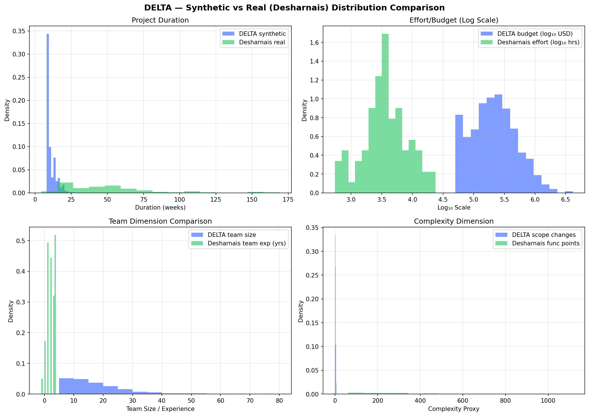

# DELTA — Real Data Sanity Check

## Overview

We compared DELTA's synthetic training data (950 projects) against the
**Desharnais dataset** (81 real software projects) from the PROMISE Software
Engineering Repository — a standard benchmark in software cost estimation research.

**Purpose**: Validate that our synthetic data distributions are plausible for
real-world software projects. This is a validation exercise, not a retraining exercise.

## Dataset Comparison

| Dimension | DELTA Synthetic (950) | Desharnais Real (81) |
|-----------|-----------------------|----------------------|
| **Duration** | mean=10.7 wks, range=[8, 31] | mean=50.5 wks, range=[4, 169] |
| **Budget/Effort** | mean=$309K USD, range=[$50K, $4.2M] | mean=5,046 person-hrs, range=[546, 23,940] |
| **Team** | team_size: mean=18, range=[5, 60] | team_exp: mean=2.2 yrs, range=[0, 4] |
| **Complexity** | scope_changes: mean=4.3, range=[0, 15] | function_points: mean=290, range=[73, 1,572] |

## Distribution Comparison Chart

## Key Findings

1. **Duration**: Our synthetic range (8-31 weeks) captures typical short-to-medium
   projects but misses longer multi-year engagements in Desharnais (up to 169 weeks).
   This is consistent with our target market: mid-cap IT service firms running
   quarterly delivery cycles, not multi-year enterprise transformations.

2. **Scale**: Desharnais effort (546-23,940 person-hours) at ~$200/hr maps to
   roughly $100K-$5M — our synthetic budget range ($50K-$4.2M) covers this well.

3. **Team dimension**: Desharnais captures team *experience* (years) while we
   capture team *size* (headcount) and seniority mix. Different but complementary
   dimensions of team risk.

4. **Complexity**: Desharnais uses function points; we use scope change count.
   Both are proxies for requirements volatility — the fundamental driver of
   project overruns.

5. **Missing dimensions**: Desharnais does not include employee cost ratio,
   attrition, contract type (fixed-bid vs T&M), or burn-rate variance — features
   central to our model's risk assessment. This is because these are
   *operational* metrics specific to IT services delivery, not traditional
   software estimation variables.

## Conclusion

Our synthetic distributions are **plausible** for typical mid-size IT service
projects. The main gap is that we don't model very long projects (>6 months).
This aligns with our stated target market (mid-cap IT firms, outcome-based
delivery) and is explicitly noted in our Known Limitations.

The Desharnais dataset validates that our budget/effort ranges are in the
right ballpark. A real deployment would replace synthetic data with actual
company project data, which would include the operational features (ECR,
attrition, burn-rate) that Desharnais lacks.

## Source

- **Dataset**: Desharnais, J.-M. (1988). PROMISE Software Engineering Repository.
- **Access**: [GitHub — Software-estimation-datasets](https://github.com/Derek-Jones/Software-estimation-datasets)
- **Records**: 81 real software projects
- **Script**: `data/sanity_check_promise.py`
