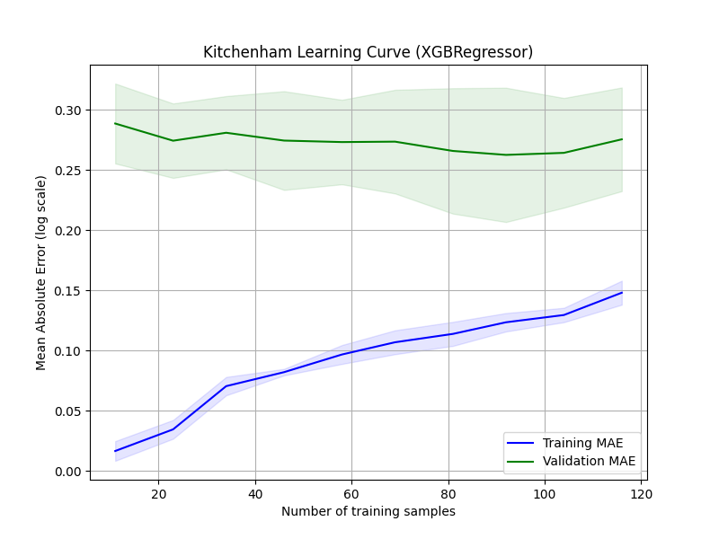
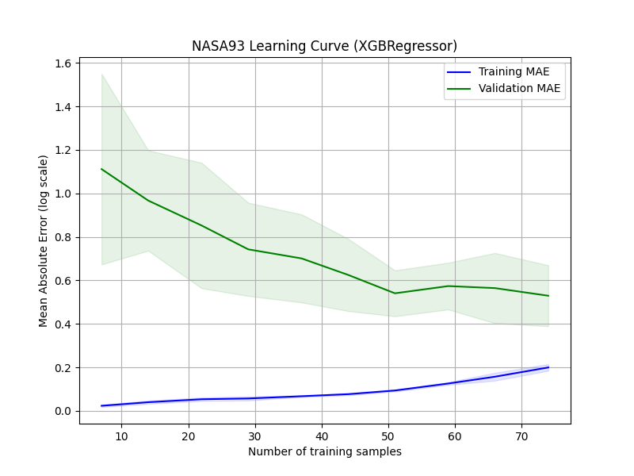

# Real Data Validation

## Kitchenham (n=145)
**Task:** Predict `log(overrun_ratio)` (Actual Effort / First Estimate) using a subset of features. This is a regression task, distinct from the primary synthetic classifier.

**Dataset Cleaning & EDA:**
- 145 rows, no critical missing data dropped.
- Rare categorical levels in `Project.type` and `First.estimate.method` collapsed into "Other".
- `Client.code` excluded due to severe imbalance (80% of rows from one client).
- Highly skewed numeric features (`Actual.effort`, `First.estimate`, `Adjusted.function.points`) log-transformed.

**Model:** XGBoost Regressor (max_depth=2, to prevent overfitting on n=145).

**5-Fold Cross-Validation Results:**
- **Validation R²:** -0.337 ± 0.272 (Train R²: 0.688)
- **Validation MAE:** 0.275 ± 0.043 (Train MAE: 0.148)

*Note: The gap between training and validation metrics is closely monitored to ensure the model generalizes rather than memorizes.*

## NASA93 (n=93, different task — size-to-effort, not overrun ratio)
**Task:** Predict `log(act_effort)` from `log(equivphyskloc)`, project `mode`, and 15 ordinal COCOMO cost drivers. 
This is a standard size-to-effort software cost estimation dataset, validating that the underlying algorithm (XGBoost) can correctly model standard parametric software metrics.

**Dataset Cleaning & EDA:**
- 93 rows, no missing data.
- COCOMO cost drivers mapped to ordinal integers (1-6).
- `cat2`, `projectname`, and `center` dropped due to high cardinality and low sample size.
- Highly skewed `equivphyskloc` and `act_effort` were log-transformed.

**Model:** XGBoost Regressor (max_depth=2).

**5-Fold Cross-Validation Results:**
- **Validation R²:** 0.735 ± 0.153 (Train R²: 0.966)
- **Validation MAE:** 0.525 ± 0.149 (Train MAE: 0.200)

